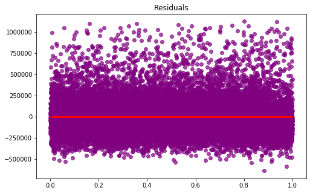

## Final Project Submission

Please fill out:
* Student name: 
* Student pace: self paced / part time / full time
* Scheduled project review date/time: 
* Instructor name: 
* Blog post URL:


### Outline

* [Hexbin](#Hexbin)
* [Scrubbing Data](#Scrubbing-the-Data)


```python
import numpy as np
import pandas as pd

import scipy.stats as scs
import statsmodels.api as sm

from sklearn.linear_model import LinearRegression
from sklearn.model_selection import train_test_split, cross_val_score
from sklearn.model_selection import StratifiedKFold

import matplotlib.pyplot as plt
import seaborn as sns
```

### Osemn process


### Custom functions


```python
# data conditioning function

def check_only_one_floor(val):
    if val == 1:
        return 1
    return 0
```

### Gather Data


```python
df = pd.read_csv("kc_house_data.csv")
```

### Hexbin


```python
hexbin = df.plot.hexbin(x='long', y='lat', C='price', figsize=(20, 20))
```


```python
fig = hexbin.get_figure()
```


```python
fig.savefig('hexbin.png')
```


```python
df.head()
```


<div>
<style scoped>
    .dataframe tbody tr th:only-of-type {
        vertical-align: middle;
    }

    .dataframe tbody tr th {
        vertical-align: top;
    }

    .dataframe thead th {
        text-align: right;
    }
</style>
<table border="1" class="dataframe">
  <thead>
    <tr style="text-align: right;">
      <th></th>
      <th>id</th>
      <th>date</th>
      <th>price</th>
      <th>bedrooms</th>
      <th>bathrooms</th>
      <th>sqft_living</th>
      <th>sqft_lot</th>
      <th>floors</th>
      <th>waterfront</th>
      <th>view</th>
      <th>...</th>
      <th>grade</th>
      <th>sqft_above</th>
      <th>sqft_basement</th>
      <th>yr_built</th>
      <th>yr_renovated</th>
      <th>zipcode</th>
      <th>lat</th>
      <th>long</th>
      <th>sqft_living15</th>
      <th>sqft_lot15</th>
    </tr>
  </thead>
  <tbody>
    <tr>
      <td>0</td>
      <td>7129300520</td>
      <td>10/13/2014</td>
      <td>221900.0</td>
      <td>3</td>
      <td>1.00</td>
      <td>1180</td>
      <td>5650</td>
      <td>1.0</td>
      <td>NaN</td>
      <td>0.0</td>
      <td>...</td>
      <td>7</td>
      <td>1180</td>
      <td>0.0</td>
      <td>1955</td>
      <td>0.0</td>
      <td>98178</td>
      <td>47.5112</td>
      <td>-122.257</td>
      <td>1340</td>
      <td>5650</td>
    </tr>
    <tr>
      <td>1</td>
      <td>6414100192</td>
      <td>12/9/2014</td>
      <td>538000.0</td>
      <td>3</td>
      <td>2.25</td>
      <td>2570</td>
      <td>7242</td>
      <td>2.0</td>
      <td>0.0</td>
      <td>0.0</td>
      <td>...</td>
      <td>7</td>
      <td>2170</td>
      <td>400.0</td>
      <td>1951</td>
      <td>1991.0</td>
      <td>98125</td>
      <td>47.7210</td>
      <td>-122.319</td>
      <td>1690</td>
      <td>7639</td>
    </tr>
    <tr>
      <td>2</td>
      <td>5631500400</td>
      <td>2/25/2015</td>
      <td>180000.0</td>
      <td>2</td>
      <td>1.00</td>
      <td>770</td>
      <td>10000</td>
      <td>1.0</td>
      <td>0.0</td>
      <td>0.0</td>
      <td>...</td>
      <td>6</td>
      <td>770</td>
      <td>0.0</td>
      <td>1933</td>
      <td>NaN</td>
      <td>98028</td>
      <td>47.7379</td>
      <td>-122.233</td>
      <td>2720</td>
      <td>8062</td>
    </tr>
    <tr>
      <td>3</td>
      <td>2487200875</td>
      <td>12/9/2014</td>
      <td>604000.0</td>
      <td>4</td>
      <td>3.00</td>
      <td>1960</td>
      <td>5000</td>
      <td>1.0</td>
      <td>0.0</td>
      <td>0.0</td>
      <td>...</td>
      <td>7</td>
      <td>1050</td>
      <td>910.0</td>
      <td>1965</td>
      <td>0.0</td>
      <td>98136</td>
      <td>47.5208</td>
      <td>-122.393</td>
      <td>1360</td>
      <td>5000</td>
    </tr>
    <tr>
      <td>4</td>
      <td>1954400510</td>
      <td>2/18/2015</td>
      <td>510000.0</td>
      <td>3</td>
      <td>2.00</td>
      <td>1680</td>
      <td>8080</td>
      <td>1.0</td>
      <td>0.0</td>
      <td>0.0</td>
      <td>...</td>
      <td>8</td>
      <td>1680</td>
      <td>0.0</td>
      <td>1987</td>
      <td>0.0</td>
      <td>98074</td>
      <td>47.6168</td>
      <td>-122.045</td>
      <td>1800</td>
      <td>7503</td>
    </tr>
  </tbody>
</table>
<p>5 rows × 21 columns</p>
</div>


```python
# fill nans with 0s this makes the most sense
df.fillna(value=0, inplace=True)
```


```python
df.shape
```


    (21597, 21)


```python
df.info()
# I see 2 object columns data and sqft_basement
# there is an 'id' column, will probably drop this
# object usually signifies a placeholder value of a string type or a dictionary type
```

    <class 'pandas.core.frame.DataFrame'>
    RangeIndex: 21597 entries, 0 to 21596
    Data columns (total 21 columns):
    id               21597 non-null int64
    date             21597 non-null object
    price            21597 non-null float64
    bedrooms         21597 non-null int64
    bathrooms        21597 non-null float64
    sqft_living      21597 non-null int64
    sqft_lot         21597 non-null int64
    floors           21597 non-null float64
    waterfront       21597 non-null float64
    view             21597 non-null float64
    condition        21597 non-null int64
    grade            21597 non-null int64
    sqft_above       21597 non-null int64
    sqft_basement    21597 non-null object
    yr_built         21597 non-null int64
    yr_renovated     21597 non-null float64
    zipcode          21597 non-null int64
    lat              21597 non-null float64
    long             21597 non-null float64
    sqft_living15    21597 non-null int64
    sqft_lot15       21597 non-null int64
    dtypes: float64(8), int64(11), object(2)
    memory usage: 3.5+ MB


```python
df.describe()

# which columns were left out, the object columns
```


<div>
<style scoped>
    .dataframe tbody tr th:only-of-type {
        vertical-align: middle;
    }

    .dataframe tbody tr th {
        vertical-align: top;
    }

    .dataframe thead th {
        text-align: right;
    }
</style>
<table border="1" class="dataframe">
  <thead>
    <tr style="text-align: right;">
      <th></th>
      <th>id</th>
      <th>price</th>
      <th>bedrooms</th>
      <th>bathrooms</th>
      <th>sqft_living</th>
      <th>sqft_lot</th>
      <th>floors</th>
      <th>waterfront</th>
      <th>view</th>
      <th>condition</th>
      <th>grade</th>
      <th>sqft_above</th>
      <th>yr_built</th>
      <th>yr_renovated</th>
      <th>zipcode</th>
      <th>lat</th>
      <th>long</th>
      <th>sqft_living15</th>
      <th>sqft_lot15</th>
    </tr>
  </thead>
  <tbody>
    <tr>
      <td>count</td>
      <td>2.159700e+04</td>
      <td>2.159700e+04</td>
      <td>21597.000000</td>
      <td>21597.000000</td>
      <td>21597.000000</td>
      <td>2.159700e+04</td>
      <td>21597.000000</td>
      <td>21597.000000</td>
      <td>21597.000000</td>
      <td>21597.000000</td>
      <td>21597.000000</td>
      <td>21597.000000</td>
      <td>21597.000000</td>
      <td>21597.000000</td>
      <td>21597.000000</td>
      <td>21597.000000</td>
      <td>21597.000000</td>
      <td>21597.000000</td>
      <td>21597.000000</td>
    </tr>
    <tr>
      <td>mean</td>
      <td>4.580474e+09</td>
      <td>5.402966e+05</td>
      <td>3.373200</td>
      <td>2.115826</td>
      <td>2080.321850</td>
      <td>1.509941e+04</td>
      <td>1.494096</td>
      <td>0.006760</td>
      <td>0.233181</td>
      <td>3.409825</td>
      <td>7.657915</td>
      <td>1788.596842</td>
      <td>1970.999676</td>
      <td>68.758207</td>
      <td>98077.951845</td>
      <td>47.560093</td>
      <td>-122.213982</td>
      <td>1986.620318</td>
      <td>12758.283512</td>
    </tr>
    <tr>
      <td>std</td>
      <td>2.876736e+09</td>
      <td>3.673681e+05</td>
      <td>0.926299</td>
      <td>0.768984</td>
      <td>918.106125</td>
      <td>4.141264e+04</td>
      <td>0.539683</td>
      <td>0.081944</td>
      <td>0.764673</td>
      <td>0.650546</td>
      <td>1.173200</td>
      <td>827.759761</td>
      <td>29.375234</td>
      <td>364.037499</td>
      <td>53.513072</td>
      <td>0.138552</td>
      <td>0.140724</td>
      <td>685.230472</td>
      <td>27274.441950</td>
    </tr>
    <tr>
      <td>min</td>
      <td>1.000102e+06</td>
      <td>7.800000e+04</td>
      <td>1.000000</td>
      <td>0.500000</td>
      <td>370.000000</td>
      <td>5.200000e+02</td>
      <td>1.000000</td>
      <td>0.000000</td>
      <td>0.000000</td>
      <td>1.000000</td>
      <td>3.000000</td>
      <td>370.000000</td>
      <td>1900.000000</td>
      <td>0.000000</td>
      <td>98001.000000</td>
      <td>47.155900</td>
      <td>-122.519000</td>
      <td>399.000000</td>
      <td>651.000000</td>
    </tr>
    <tr>
      <td>25%</td>
      <td>2.123049e+09</td>
      <td>3.220000e+05</td>
      <td>3.000000</td>
      <td>1.750000</td>
      <td>1430.000000</td>
      <td>5.040000e+03</td>
      <td>1.000000</td>
      <td>0.000000</td>
      <td>0.000000</td>
      <td>3.000000</td>
      <td>7.000000</td>
      <td>1190.000000</td>
      <td>1951.000000</td>
      <td>0.000000</td>
      <td>98033.000000</td>
      <td>47.471100</td>
      <td>-122.328000</td>
      <td>1490.000000</td>
      <td>5100.000000</td>
    </tr>
    <tr>
      <td>50%</td>
      <td>3.904930e+09</td>
      <td>4.500000e+05</td>
      <td>3.000000</td>
      <td>2.250000</td>
      <td>1910.000000</td>
      <td>7.618000e+03</td>
      <td>1.500000</td>
      <td>0.000000</td>
      <td>0.000000</td>
      <td>3.000000</td>
      <td>7.000000</td>
      <td>1560.000000</td>
      <td>1975.000000</td>
      <td>0.000000</td>
      <td>98065.000000</td>
      <td>47.571800</td>
      <td>-122.231000</td>
      <td>1840.000000</td>
      <td>7620.000000</td>
    </tr>
    <tr>
      <td>75%</td>
      <td>7.308900e+09</td>
      <td>6.450000e+05</td>
      <td>4.000000</td>
      <td>2.500000</td>
      <td>2550.000000</td>
      <td>1.068500e+04</td>
      <td>2.000000</td>
      <td>0.000000</td>
      <td>0.000000</td>
      <td>4.000000</td>
      <td>8.000000</td>
      <td>2210.000000</td>
      <td>1997.000000</td>
      <td>0.000000</td>
      <td>98118.000000</td>
      <td>47.678000</td>
      <td>-122.125000</td>
      <td>2360.000000</td>
      <td>10083.000000</td>
    </tr>
    <tr>
      <td>max</td>
      <td>9.900000e+09</td>
      <td>7.700000e+06</td>
      <td>33.000000</td>
      <td>8.000000</td>
      <td>13540.000000</td>
      <td>1.651359e+06</td>
      <td>3.500000</td>
      <td>1.000000</td>
      <td>4.000000</td>
      <td>5.000000</td>
      <td>13.000000</td>
      <td>9410.000000</td>
      <td>2015.000000</td>
      <td>2015.000000</td>
      <td>98199.000000</td>
      <td>47.777600</td>
      <td>-121.315000</td>
      <td>6210.000000</td>
      <td>871200.000000</td>
    </tr>
  </tbody>
</table>
</div>


### Scrubbing the Data

#### Cleaning null values and placeholders


```python
df = df.drop("id", axis=1)
df.head()
```


<div>
<style scoped>
    .dataframe tbody tr th:only-of-type {
        vertical-align: middle;
    }

    .dataframe tbody tr th {
        vertical-align: top;
    }

    .dataframe thead th {
        text-align: right;
    }
</style>
<table border="1" class="dataframe">
  <thead>
    <tr style="text-align: right;">
      <th></th>
      <th>date</th>
      <th>price</th>
      <th>bedrooms</th>
      <th>bathrooms</th>
      <th>sqft_living</th>
      <th>sqft_lot</th>
      <th>floors</th>
      <th>waterfront</th>
      <th>view</th>
      <th>condition</th>
      <th>grade</th>
      <th>sqft_above</th>
      <th>sqft_basement</th>
      <th>yr_built</th>
      <th>yr_renovated</th>
      <th>zipcode</th>
      <th>lat</th>
      <th>long</th>
      <th>sqft_living15</th>
      <th>sqft_lot15</th>
    </tr>
  </thead>
  <tbody>
    <tr>
      <td>0</td>
      <td>10/13/2014</td>
      <td>221900.0</td>
      <td>3</td>
      <td>1.00</td>
      <td>1180</td>
      <td>5650</td>
      <td>1.0</td>
      <td>0.0</td>
      <td>0.0</td>
      <td>3</td>
      <td>7</td>
      <td>1180</td>
      <td>0.0</td>
      <td>1955</td>
      <td>0.0</td>
      <td>98178</td>
      <td>47.5112</td>
      <td>-122.257</td>
      <td>1340</td>
      <td>5650</td>
    </tr>
    <tr>
      <td>1</td>
      <td>12/9/2014</td>
      <td>538000.0</td>
      <td>3</td>
      <td>2.25</td>
      <td>2570</td>
      <td>7242</td>
      <td>2.0</td>
      <td>0.0</td>
      <td>0.0</td>
      <td>3</td>
      <td>7</td>
      <td>2170</td>
      <td>400.0</td>
      <td>1951</td>
      <td>1991.0</td>
      <td>98125</td>
      <td>47.7210</td>
      <td>-122.319</td>
      <td>1690</td>
      <td>7639</td>
    </tr>
    <tr>
      <td>2</td>
      <td>2/25/2015</td>
      <td>180000.0</td>
      <td>2</td>
      <td>1.00</td>
      <td>770</td>
      <td>10000</td>
      <td>1.0</td>
      <td>0.0</td>
      <td>0.0</td>
      <td>3</td>
      <td>6</td>
      <td>770</td>
      <td>0.0</td>
      <td>1933</td>
      <td>0.0</td>
      <td>98028</td>
      <td>47.7379</td>
      <td>-122.233</td>
      <td>2720</td>
      <td>8062</td>
    </tr>
    <tr>
      <td>3</td>
      <td>12/9/2014</td>
      <td>604000.0</td>
      <td>4</td>
      <td>3.00</td>
      <td>1960</td>
      <td>5000</td>
      <td>1.0</td>
      <td>0.0</td>
      <td>0.0</td>
      <td>5</td>
      <td>7</td>
      <td>1050</td>
      <td>910.0</td>
      <td>1965</td>
      <td>0.0</td>
      <td>98136</td>
      <td>47.5208</td>
      <td>-122.393</td>
      <td>1360</td>
      <td>5000</td>
    </tr>
    <tr>
      <td>4</td>
      <td>2/18/2015</td>
      <td>510000.0</td>
      <td>3</td>
      <td>2.00</td>
      <td>1680</td>
      <td>8080</td>
      <td>1.0</td>
      <td>0.0</td>
      <td>0.0</td>
      <td>3</td>
      <td>8</td>
      <td>1680</td>
      <td>0.0</td>
      <td>1987</td>
      <td>0.0</td>
      <td>98074</td>
      <td>47.6168</td>
      <td>-122.045</td>
      <td>1800</td>
      <td>7503</td>
    </tr>
  </tbody>
</table>
</div>


```python
# counts null values in each column
# so sqft_basement has no null values
# but it definitely contains strings
df.isna().sum()
```


    date             0
    price            0
    bedrooms         0
    bathrooms        0
    sqft_living      0
    sqft_lot         0
    floors           0
    waterfront       0
    view             0
    condition        0
    grade            0
    sqft_above       0
    sqft_basement    0
    yr_built         0
    yr_renovated     0
    zipcode          0
    lat              0
    long             0
    sqft_living15    0
    sqft_lot15       0
    dtype: int64


```python
# let's run value_counts on df.sqft_basement

df.sqft_basement.value_counts()[:5]
```


    0.0      12826
    ?          454
    600.0      217
    500.0      209
    700.0      208
    Name: sqft_basement, dtype: int64


```python
# how can i handle these question marks to get the median and mean

# changing all the values to numerical strings
df.loc[df["sqft_basement"]=="?", ['sqft_basement']]='-1.0'

df["sqft_basement"].value_counts()

df["sqft_basement"] = df["sqft_basement"].astype(float).astype(int)

df.head()
```


<div>
<style scoped>
    .dataframe tbody tr th:only-of-type {
        vertical-align: middle;
    }

    .dataframe tbody tr th {
        vertical-align: top;
    }

    .dataframe thead th {
        text-align: right;
    }
</style>
<table border="1" class="dataframe">
  <thead>
    <tr style="text-align: right;">
      <th></th>
      <th>date</th>
      <th>price</th>
      <th>bedrooms</th>
      <th>bathrooms</th>
      <th>sqft_living</th>
      <th>sqft_lot</th>
      <th>floors</th>
      <th>waterfront</th>
      <th>view</th>
      <th>condition</th>
      <th>grade</th>
      <th>sqft_above</th>
      <th>sqft_basement</th>
      <th>yr_built</th>
      <th>yr_renovated</th>
      <th>zipcode</th>
      <th>lat</th>
      <th>long</th>
      <th>sqft_living15</th>
      <th>sqft_lot15</th>
    </tr>
  </thead>
  <tbody>
    <tr>
      <td>0</td>
      <td>10/13/2014</td>
      <td>221900.0</td>
      <td>3</td>
      <td>1.00</td>
      <td>1180</td>
      <td>5650</td>
      <td>1.0</td>
      <td>0.0</td>
      <td>0.0</td>
      <td>3</td>
      <td>7</td>
      <td>1180</td>
      <td>0</td>
      <td>1955</td>
      <td>0.0</td>
      <td>98178</td>
      <td>47.5112</td>
      <td>-122.257</td>
      <td>1340</td>
      <td>5650</td>
    </tr>
    <tr>
      <td>1</td>
      <td>12/9/2014</td>
      <td>538000.0</td>
      <td>3</td>
      <td>2.25</td>
      <td>2570</td>
      <td>7242</td>
      <td>2.0</td>
      <td>0.0</td>
      <td>0.0</td>
      <td>3</td>
      <td>7</td>
      <td>2170</td>
      <td>400</td>
      <td>1951</td>
      <td>1991.0</td>
      <td>98125</td>
      <td>47.7210</td>
      <td>-122.319</td>
      <td>1690</td>
      <td>7639</td>
    </tr>
    <tr>
      <td>2</td>
      <td>2/25/2015</td>
      <td>180000.0</td>
      <td>2</td>
      <td>1.00</td>
      <td>770</td>
      <td>10000</td>
      <td>1.0</td>
      <td>0.0</td>
      <td>0.0</td>
      <td>3</td>
      <td>6</td>
      <td>770</td>
      <td>0</td>
      <td>1933</td>
      <td>0.0</td>
      <td>98028</td>
      <td>47.7379</td>
      <td>-122.233</td>
      <td>2720</td>
      <td>8062</td>
    </tr>
    <tr>
      <td>3</td>
      <td>12/9/2014</td>
      <td>604000.0</td>
      <td>4</td>
      <td>3.00</td>
      <td>1960</td>
      <td>5000</td>
      <td>1.0</td>
      <td>0.0</td>
      <td>0.0</td>
      <td>5</td>
      <td>7</td>
      <td>1050</td>
      <td>910</td>
      <td>1965</td>
      <td>0.0</td>
      <td>98136</td>
      <td>47.5208</td>
      <td>-122.393</td>
      <td>1360</td>
      <td>5000</td>
    </tr>
    <tr>
      <td>4</td>
      <td>2/18/2015</td>
      <td>510000.0</td>
      <td>3</td>
      <td>2.00</td>
      <td>1680</td>
      <td>8080</td>
      <td>1.0</td>
      <td>0.0</td>
      <td>0.0</td>
      <td>3</td>
      <td>8</td>
      <td>1680</td>
      <td>0</td>
      <td>1987</td>
      <td>0.0</td>
      <td>98074</td>
      <td>47.6168</td>
      <td>-122.045</td>
      <td>1800</td>
      <td>7503</td>
    </tr>
  </tbody>
</table>
</div>


```python
df.describe()
```


<div>
<style scoped>
    .dataframe tbody tr th:only-of-type {
        vertical-align: middle;
    }

    .dataframe tbody tr th {
        vertical-align: top;
    }

    .dataframe thead th {
        text-align: right;
    }
</style>
<table border="1" class="dataframe">
  <thead>
    <tr style="text-align: right;">
      <th></th>
      <th>price</th>
      <th>bedrooms</th>
      <th>bathrooms</th>
      <th>sqft_living</th>
      <th>sqft_lot</th>
      <th>floors</th>
      <th>waterfront</th>
      <th>view</th>
      <th>condition</th>
      <th>grade</th>
      <th>sqft_above</th>
      <th>sqft_basement</th>
      <th>yr_built</th>
      <th>yr_renovated</th>
      <th>zipcode</th>
      <th>lat</th>
      <th>long</th>
      <th>sqft_living15</th>
      <th>sqft_lot15</th>
    </tr>
  </thead>
  <tbody>
    <tr>
      <td>count</td>
      <td>2.159700e+04</td>
      <td>21597.000000</td>
      <td>21597.000000</td>
      <td>21597.000000</td>
      <td>2.159700e+04</td>
      <td>21597.000000</td>
      <td>21597.000000</td>
      <td>21597.000000</td>
      <td>21597.000000</td>
      <td>21597.000000</td>
      <td>21597.000000</td>
      <td>21597.000000</td>
      <td>21597.000000</td>
      <td>21597.000000</td>
      <td>21597.000000</td>
      <td>21597.000000</td>
      <td>21597.000000</td>
      <td>21597.000000</td>
      <td>21597.000000</td>
    </tr>
    <tr>
      <td>mean</td>
      <td>5.402966e+05</td>
      <td>3.373200</td>
      <td>2.115826</td>
      <td>2080.321850</td>
      <td>1.509941e+04</td>
      <td>1.494096</td>
      <td>0.006760</td>
      <td>0.233181</td>
      <td>3.409825</td>
      <td>7.657915</td>
      <td>1788.596842</td>
      <td>285.695560</td>
      <td>1970.999676</td>
      <td>68.758207</td>
      <td>98077.951845</td>
      <td>47.560093</td>
      <td>-122.213982</td>
      <td>1986.620318</td>
      <td>12758.283512</td>
    </tr>
    <tr>
      <td>std</td>
      <td>3.673681e+05</td>
      <td>0.926299</td>
      <td>0.768984</td>
      <td>918.106125</td>
      <td>4.141264e+04</td>
      <td>0.539683</td>
      <td>0.081944</td>
      <td>0.764673</td>
      <td>0.650546</td>
      <td>1.173200</td>
      <td>827.759761</td>
      <td>439.833509</td>
      <td>29.375234</td>
      <td>364.037499</td>
      <td>53.513072</td>
      <td>0.138552</td>
      <td>0.140724</td>
      <td>685.230472</td>
      <td>27274.441950</td>
    </tr>
    <tr>
      <td>min</td>
      <td>7.800000e+04</td>
      <td>1.000000</td>
      <td>0.500000</td>
      <td>370.000000</td>
      <td>5.200000e+02</td>
      <td>1.000000</td>
      <td>0.000000</td>
      <td>0.000000</td>
      <td>1.000000</td>
      <td>3.000000</td>
      <td>370.000000</td>
      <td>-1.000000</td>
      <td>1900.000000</td>
      <td>0.000000</td>
      <td>98001.000000</td>
      <td>47.155900</td>
      <td>-122.519000</td>
      <td>399.000000</td>
      <td>651.000000</td>
    </tr>
    <tr>
      <td>25%</td>
      <td>3.220000e+05</td>
      <td>3.000000</td>
      <td>1.750000</td>
      <td>1430.000000</td>
      <td>5.040000e+03</td>
      <td>1.000000</td>
      <td>0.000000</td>
      <td>0.000000</td>
      <td>3.000000</td>
      <td>7.000000</td>
      <td>1190.000000</td>
      <td>0.000000</td>
      <td>1951.000000</td>
      <td>0.000000</td>
      <td>98033.000000</td>
      <td>47.471100</td>
      <td>-122.328000</td>
      <td>1490.000000</td>
      <td>5100.000000</td>
    </tr>
    <tr>
      <td>50%</td>
      <td>4.500000e+05</td>
      <td>3.000000</td>
      <td>2.250000</td>
      <td>1910.000000</td>
      <td>7.618000e+03</td>
      <td>1.500000</td>
      <td>0.000000</td>
      <td>0.000000</td>
      <td>3.000000</td>
      <td>7.000000</td>
      <td>1560.000000</td>
      <td>0.000000</td>
      <td>1975.000000</td>
      <td>0.000000</td>
      <td>98065.000000</td>
      <td>47.571800</td>
      <td>-122.231000</td>
      <td>1840.000000</td>
      <td>7620.000000</td>
    </tr>
    <tr>
      <td>75%</td>
      <td>6.450000e+05</td>
      <td>4.000000</td>
      <td>2.500000</td>
      <td>2550.000000</td>
      <td>1.068500e+04</td>
      <td>2.000000</td>
      <td>0.000000</td>
      <td>0.000000</td>
      <td>4.000000</td>
      <td>8.000000</td>
      <td>2210.000000</td>
      <td>550.000000</td>
      <td>1997.000000</td>
      <td>0.000000</td>
      <td>98118.000000</td>
      <td>47.678000</td>
      <td>-122.125000</td>
      <td>2360.000000</td>
      <td>10083.000000</td>
    </tr>
    <tr>
      <td>max</td>
      <td>7.700000e+06</td>
      <td>33.000000</td>
      <td>8.000000</td>
      <td>13540.000000</td>
      <td>1.651359e+06</td>
      <td>3.500000</td>
      <td>1.000000</td>
      <td>4.000000</td>
      <td>5.000000</td>
      <td>13.000000</td>
      <td>9410.000000</td>
      <td>4820.000000</td>
      <td>2015.000000</td>
      <td>2015.000000</td>
      <td>98199.000000</td>
      <td>47.777600</td>
      <td>-121.315000</td>
      <td>6210.000000</td>
      <td>871200.000000</td>
    </tr>
  </tbody>
</table>
</div>


```python
sqft_basement_mean = df.loc[df.sqft_basement!=-1, ['sqft_basement']].mean()
sqft_basement_med = df.loc[df.sqft_basement!=-1, ['sqft_basement']].median()
sqft_basement_mean, sqft_basement_med
```


    (sqft_basement    291.851724
     dtype: float64, sqft_basement    0.0
     dtype: float64)


```python
df["sqft_basement"].replace(to_replace=-1, value=0, inplace=True)

df.describe()
```


<div>
<style scoped>
    .dataframe tbody tr th:only-of-type {
        vertical-align: middle;
    }

    .dataframe tbody tr th {
        vertical-align: top;
    }

    .dataframe thead th {
        text-align: right;
    }
</style>
<table border="1" class="dataframe">
  <thead>
    <tr style="text-align: right;">
      <th></th>
      <th>price</th>
      <th>bedrooms</th>
      <th>bathrooms</th>
      <th>sqft_living</th>
      <th>sqft_lot</th>
      <th>floors</th>
      <th>waterfront</th>
      <th>view</th>
      <th>condition</th>
      <th>grade</th>
      <th>sqft_above</th>
      <th>sqft_basement</th>
      <th>yr_built</th>
      <th>yr_renovated</th>
      <th>zipcode</th>
      <th>lat</th>
      <th>long</th>
      <th>sqft_living15</th>
      <th>sqft_lot15</th>
    </tr>
  </thead>
  <tbody>
    <tr>
      <td>count</td>
      <td>2.159700e+04</td>
      <td>21597.000000</td>
      <td>21597.000000</td>
      <td>21597.000000</td>
      <td>2.159700e+04</td>
      <td>21597.000000</td>
      <td>21597.000000</td>
      <td>21597.000000</td>
      <td>21597.000000</td>
      <td>21597.000000</td>
      <td>21597.000000</td>
      <td>21597.000000</td>
      <td>21597.000000</td>
      <td>21597.000000</td>
      <td>21597.000000</td>
      <td>21597.000000</td>
      <td>21597.000000</td>
      <td>21597.000000</td>
      <td>21597.000000</td>
    </tr>
    <tr>
      <td>mean</td>
      <td>5.402966e+05</td>
      <td>3.373200</td>
      <td>2.115826</td>
      <td>2080.321850</td>
      <td>1.509941e+04</td>
      <td>1.494096</td>
      <td>0.006760</td>
      <td>0.233181</td>
      <td>3.409825</td>
      <td>7.657915</td>
      <td>1788.596842</td>
      <td>285.716581</td>
      <td>1970.999676</td>
      <td>68.758207</td>
      <td>98077.951845</td>
      <td>47.560093</td>
      <td>-122.213982</td>
      <td>1986.620318</td>
      <td>12758.283512</td>
    </tr>
    <tr>
      <td>std</td>
      <td>3.673681e+05</td>
      <td>0.926299</td>
      <td>0.768984</td>
      <td>918.106125</td>
      <td>4.141264e+04</td>
      <td>0.539683</td>
      <td>0.081944</td>
      <td>0.764673</td>
      <td>0.650546</td>
      <td>1.173200</td>
      <td>827.759761</td>
      <td>439.819830</td>
      <td>29.375234</td>
      <td>364.037499</td>
      <td>53.513072</td>
      <td>0.138552</td>
      <td>0.140724</td>
      <td>685.230472</td>
      <td>27274.441950</td>
    </tr>
    <tr>
      <td>min</td>
      <td>7.800000e+04</td>
      <td>1.000000</td>
      <td>0.500000</td>
      <td>370.000000</td>
      <td>5.200000e+02</td>
      <td>1.000000</td>
      <td>0.000000</td>
      <td>0.000000</td>
      <td>1.000000</td>
      <td>3.000000</td>
      <td>370.000000</td>
      <td>0.000000</td>
      <td>1900.000000</td>
      <td>0.000000</td>
      <td>98001.000000</td>
      <td>47.155900</td>
      <td>-122.519000</td>
      <td>399.000000</td>
      <td>651.000000</td>
    </tr>
    <tr>
      <td>25%</td>
      <td>3.220000e+05</td>
      <td>3.000000</td>
      <td>1.750000</td>
      <td>1430.000000</td>
      <td>5.040000e+03</td>
      <td>1.000000</td>
      <td>0.000000</td>
      <td>0.000000</td>
      <td>3.000000</td>
      <td>7.000000</td>
      <td>1190.000000</td>
      <td>0.000000</td>
      <td>1951.000000</td>
      <td>0.000000</td>
      <td>98033.000000</td>
      <td>47.471100</td>
      <td>-122.328000</td>
      <td>1490.000000</td>
      <td>5100.000000</td>
    </tr>
    <tr>
      <td>50%</td>
      <td>4.500000e+05</td>
      <td>3.000000</td>
      <td>2.250000</td>
      <td>1910.000000</td>
      <td>7.618000e+03</td>
      <td>1.500000</td>
      <td>0.000000</td>
      <td>0.000000</td>
      <td>3.000000</td>
      <td>7.000000</td>
      <td>1560.000000</td>
      <td>0.000000</td>
      <td>1975.000000</td>
      <td>0.000000</td>
      <td>98065.000000</td>
      <td>47.571800</td>
      <td>-122.231000</td>
      <td>1840.000000</td>
      <td>7620.000000</td>
    </tr>
    <tr>
      <td>75%</td>
      <td>6.450000e+05</td>
      <td>4.000000</td>
      <td>2.500000</td>
      <td>2550.000000</td>
      <td>1.068500e+04</td>
      <td>2.000000</td>
      <td>0.000000</td>
      <td>0.000000</td>
      <td>4.000000</td>
      <td>8.000000</td>
      <td>2210.000000</td>
      <td>550.000000</td>
      <td>1997.000000</td>
      <td>0.000000</td>
      <td>98118.000000</td>
      <td>47.678000</td>
      <td>-122.125000</td>
      <td>2360.000000</td>
      <td>10083.000000</td>
    </tr>
    <tr>
      <td>max</td>
      <td>7.700000e+06</td>
      <td>33.000000</td>
      <td>8.000000</td>
      <td>13540.000000</td>
      <td>1.651359e+06</td>
      <td>3.500000</td>
      <td>1.000000</td>
      <td>4.000000</td>
      <td>5.000000</td>
      <td>13.000000</td>
      <td>9410.000000</td>
      <td>4820.000000</td>
      <td>2015.000000</td>
      <td>2015.000000</td>
      <td>98199.000000</td>
      <td>47.777600</td>
      <td>-121.315000</td>
      <td>6210.000000</td>
      <td>871200.000000</td>
    </tr>
  </tbody>
</table>
</div>


### Data Condition

#### binning values, playing with null values, normalizing data, standardizing data
#### manipulating data to fit OLS assumptions
#### Grouping data to create categories that might make sense for your data


#### example, let's bin some of our data


```python
plt.hist(df.floors)
plt.show()

display(df.floors.value_counts())
```


    1.0    10673
    2.0     8235
    1.5     1910
    3.0      611
    2.5      161
    3.5        7
    Name: floors, dtype: int64


```python
# let's make it categorial for greater than 1 floor
# 1.0 -> 1
# 2.0, 3.0, 4.0, 5.0 -> 0

df["only_one_floor"] = df["floors"].apply(check_only_one_floor)
```


```python
df.head()
```


<div>
<style scoped>
    .dataframe tbody tr th:only-of-type {
        vertical-align: middle;
    }

    .dataframe tbody tr th {
        vertical-align: top;
    }

    .dataframe thead th {
        text-align: right;
    }
</style>
<table border="1" class="dataframe">
  <thead>
    <tr style="text-align: right;">
      <th></th>
      <th>date</th>
      <th>price</th>
      <th>bedrooms</th>
      <th>bathrooms</th>
      <th>sqft_living</th>
      <th>sqft_lot</th>
      <th>floors</th>
      <th>waterfront</th>
      <th>view</th>
      <th>condition</th>
      <th>...</th>
      <th>sqft_above</th>
      <th>sqft_basement</th>
      <th>yr_built</th>
      <th>yr_renovated</th>
      <th>zipcode</th>
      <th>lat</th>
      <th>long</th>
      <th>sqft_living15</th>
      <th>sqft_lot15</th>
      <th>only_one_floor</th>
    </tr>
  </thead>
  <tbody>
    <tr>
      <td>0</td>
      <td>10/13/2014</td>
      <td>221900.0</td>
      <td>3</td>
      <td>1.00</td>
      <td>1180</td>
      <td>5650</td>
      <td>1.0</td>
      <td>0.0</td>
      <td>0.0</td>
      <td>3</td>
      <td>...</td>
      <td>1180</td>
      <td>0</td>
      <td>1955</td>
      <td>0.0</td>
      <td>98178</td>
      <td>47.5112</td>
      <td>-122.257</td>
      <td>1340</td>
      <td>5650</td>
      <td>1</td>
    </tr>
    <tr>
      <td>1</td>
      <td>12/9/2014</td>
      <td>538000.0</td>
      <td>3</td>
      <td>2.25</td>
      <td>2570</td>
      <td>7242</td>
      <td>2.0</td>
      <td>0.0</td>
      <td>0.0</td>
      <td>3</td>
      <td>...</td>
      <td>2170</td>
      <td>400</td>
      <td>1951</td>
      <td>1991.0</td>
      <td>98125</td>
      <td>47.7210</td>
      <td>-122.319</td>
      <td>1690</td>
      <td>7639</td>
      <td>0</td>
    </tr>
    <tr>
      <td>2</td>
      <td>2/25/2015</td>
      <td>180000.0</td>
      <td>2</td>
      <td>1.00</td>
      <td>770</td>
      <td>10000</td>
      <td>1.0</td>
      <td>0.0</td>
      <td>0.0</td>
      <td>3</td>
      <td>...</td>
      <td>770</td>
      <td>0</td>
      <td>1933</td>
      <td>0.0</td>
      <td>98028</td>
      <td>47.7379</td>
      <td>-122.233</td>
      <td>2720</td>
      <td>8062</td>
      <td>1</td>
    </tr>
    <tr>
      <td>3</td>
      <td>12/9/2014</td>
      <td>604000.0</td>
      <td>4</td>
      <td>3.00</td>
      <td>1960</td>
      <td>5000</td>
      <td>1.0</td>
      <td>0.0</td>
      <td>0.0</td>
      <td>5</td>
      <td>...</td>
      <td>1050</td>
      <td>910</td>
      <td>1965</td>
      <td>0.0</td>
      <td>98136</td>
      <td>47.5208</td>
      <td>-122.393</td>
      <td>1360</td>
      <td>5000</td>
      <td>1</td>
    </tr>
    <tr>
      <td>4</td>
      <td>2/18/2015</td>
      <td>510000.0</td>
      <td>3</td>
      <td>2.00</td>
      <td>1680</td>
      <td>8080</td>
      <td>1.0</td>
      <td>0.0</td>
      <td>0.0</td>
      <td>3</td>
      <td>...</td>
      <td>1680</td>
      <td>0</td>
      <td>1987</td>
      <td>0.0</td>
      <td>98074</td>
      <td>47.6168</td>
      <td>-122.045</td>
      <td>1800</td>
      <td>7503</td>
      <td>1</td>
    </tr>
  </tbody>
</table>
<p>5 rows × 21 columns</p>
</div>


```python
plt.hist(df.only_one_floor)
plt.show()
```


### Exploration (Analysis)


```python
plt.figure(figsize=(10, 10))
sns.violinplot(x='floors', y='price', data=df)
plt.show()
```


**Violin Plot Summary**
- The means across the group are very similar
- They have a similar distribution across the board
- 2.5 floors has the highest prices and the largest range
- 3.5 floors has negative prices...


```python
### Confusion Matrix and Correlation Heatmap
pd.plotting.scatter_matrix(df, figsize=(20, 20))
plt.show()
```


```python
def make_heatmap(df=df, columns=None, figsize=(20, 20)):
    if columns is None:
        corr = df.corr()
    else:
        corr = df[columns].corr()

    plt.figure(figsize=figsize)
    sns.heatmap(np.abs(corr), cmap=sns.color_palette('Blues'), annot=True, fmt='0.2g')
    plt.show()

make_heatmap()
```


### Modeling / Cross Validation

### let's start with some features for our model building
- keep everything in the same cell, so you can make it a function, easily
- make sure you use variable names for everything so you can easily make it into a function


```python
def make_ols_model(df=df, target='price', columns_to_use=None, add_constant=True):
    
    # just build a model and see the output

    X = df[columns_to_use]
    y = df[target]

    # add a constant to my X
    if add_constant:
        X = sm.add_constant(X)
    
    ols = sm.OLS(y, X)
    results = ols.fit()
    print(results.summary())
    return ols, results
```


```python
# experiment 1 - use everything somewhat correlated to price
columns = ['sqft_living15', 'lat', 'sqft_above', 'grade', 'view', 'sqft_living', 'bathrooms', 'bedrooms']
ols = make_ols_model(columns_to_use=columns)
```

                                OLS Regression Results                            
    ==============================================================================
    Dep. Variable:                  price   R-squared:                       0.639
    Model:                            OLS   Adj. R-squared:                  0.639
    Method:                 Least Squares   F-statistic:                     4783.
    Date:                Thu, 26 Sep 2019   Prob (F-statistic):               0.00
    Time:                        13:18:19   Log-Likelihood:            -2.9638e+05
    No. Observations:               21597   AIC:                         5.928e+05
    Df Residuals:                   21588   BIC:                         5.928e+05
    Df Model:                           8                                         
    Covariance Type:            nonrobust                                         
    =================================================================================
                        coef    std err          t      P>|t|      [0.025      0.975]
    ---------------------------------------------------------------------------------
    const         -3.181e+07   5.24e+05    -60.678      0.000   -3.28e+07   -3.08e+07
    sqft_living15     4.2253      3.614      1.169      0.242      -2.859      11.310
    lat            6.608e+05   1.11e+04     59.771      0.000    6.39e+05    6.83e+05
    sqft_above      -11.8291      4.106     -2.881      0.004     -19.878      -3.780
    grade          7.874e+04   2260.281     34.837      0.000    7.43e+04    8.32e+04
    view           9.382e+04   2122.629     44.200      0.000    8.97e+04     9.8e+04
    sqft_living     208.7275      4.368     47.781      0.000     200.165     217.290
    bathrooms     -1.317e+04   3118.563     -4.222      0.000   -1.93e+04   -7055.295
    bedrooms      -2.834e+04   2060.725    -13.752      0.000   -3.24e+04   -2.43e+04
    ==============================================================================
    Omnibus:                    18870.324   Durbin-Watson:                   1.993
    Prob(Omnibus):                  0.000   Jarque-Bera (JB):          1749172.499
    Skew:                           3.768   Prob(JB):                         0.00
    Kurtosis:                      46.440   Cond. No.                     1.27e+06
    ==============================================================================
    
    Warnings:
    [1] Standard Errors assume that the covariance matrix of the errors is correctly specified.
    [2] The condition number is large, 1.27e+06. This might indicate that there are
    strong multicollinearity or other numerical problems.


    /Users/rafael/anaconda3/envs/flatiron-env/lib/python3.6/site-packages/numpy/core/fromnumeric.py:2389: FutureWarning: Method .ptp is deprecated and will be removed in a future version. Use numpy.ptp instead.
      return ptp(axis=axis, out=out, **kwargs)


### Experiment 1 Summary
- 1 pvalue is greater than 0.05
- High condition number -> multicollinearity
- Not really worth investigating other aspects. Need to handle MC first. 


```python
# dropping sqft_above and sqft_living15 since sqft_living has the highest coefficient
# sqft_living, bathrooms and bedrooms all are correlated

# how do we address this multicollinearity? 
```


```python
# let's do some feature engineering!!!!

df.head()
```


<div>
<style scoped>
    .dataframe tbody tr th:only-of-type {
        vertical-align: middle;
    }

    .dataframe tbody tr th {
        vertical-align: top;
    }

    .dataframe thead th {
        text-align: right;
    }
</style>
<table border="1" class="dataframe">
  <thead>
    <tr style="text-align: right;">
      <th></th>
      <th>date</th>
      <th>price</th>
      <th>bedrooms</th>
      <th>bathrooms</th>
      <th>sqft_living</th>
      <th>sqft_lot</th>
      <th>floors</th>
      <th>waterfront</th>
      <th>view</th>
      <th>condition</th>
      <th>...</th>
      <th>sqft_above</th>
      <th>sqft_basement</th>
      <th>yr_built</th>
      <th>yr_renovated</th>
      <th>zipcode</th>
      <th>lat</th>
      <th>long</th>
      <th>sqft_living15</th>
      <th>sqft_lot15</th>
      <th>only_one_floor</th>
    </tr>
  </thead>
  <tbody>
    <tr>
      <td>0</td>
      <td>10/13/2014</td>
      <td>221900.0</td>
      <td>3</td>
      <td>1.00</td>
      <td>1180</td>
      <td>5650</td>
      <td>1.0</td>
      <td>0.0</td>
      <td>0.0</td>
      <td>3</td>
      <td>...</td>
      <td>1180</td>
      <td>0</td>
      <td>1955</td>
      <td>0.0</td>
      <td>98178</td>
      <td>47.5112</td>
      <td>-122.257</td>
      <td>1340</td>
      <td>5650</td>
      <td>1</td>
    </tr>
    <tr>
      <td>1</td>
      <td>12/9/2014</td>
      <td>538000.0</td>
      <td>3</td>
      <td>2.25</td>
      <td>2570</td>
      <td>7242</td>
      <td>2.0</td>
      <td>0.0</td>
      <td>0.0</td>
      <td>3</td>
      <td>...</td>
      <td>2170</td>
      <td>400</td>
      <td>1951</td>
      <td>1991.0</td>
      <td>98125</td>
      <td>47.7210</td>
      <td>-122.319</td>
      <td>1690</td>
      <td>7639</td>
      <td>0</td>
    </tr>
    <tr>
      <td>2</td>
      <td>2/25/2015</td>
      <td>180000.0</td>
      <td>2</td>
      <td>1.00</td>
      <td>770</td>
      <td>10000</td>
      <td>1.0</td>
      <td>0.0</td>
      <td>0.0</td>
      <td>3</td>
      <td>...</td>
      <td>770</td>
      <td>0</td>
      <td>1933</td>
      <td>0.0</td>
      <td>98028</td>
      <td>47.7379</td>
      <td>-122.233</td>
      <td>2720</td>
      <td>8062</td>
      <td>1</td>
    </tr>
    <tr>
      <td>3</td>
      <td>12/9/2014</td>
      <td>604000.0</td>
      <td>4</td>
      <td>3.00</td>
      <td>1960</td>
      <td>5000</td>
      <td>1.0</td>
      <td>0.0</td>
      <td>0.0</td>
      <td>5</td>
      <td>...</td>
      <td>1050</td>
      <td>910</td>
      <td>1965</td>
      <td>0.0</td>
      <td>98136</td>
      <td>47.5208</td>
      <td>-122.393</td>
      <td>1360</td>
      <td>5000</td>
      <td>1</td>
    </tr>
    <tr>
      <td>4</td>
      <td>2/18/2015</td>
      <td>510000.0</td>
      <td>3</td>
      <td>2.00</td>
      <td>1680</td>
      <td>8080</td>
      <td>1.0</td>
      <td>0.0</td>
      <td>0.0</td>
      <td>3</td>
      <td>...</td>
      <td>1680</td>
      <td>0</td>
      <td>1987</td>
      <td>0.0</td>
      <td>98074</td>
      <td>47.6168</td>
      <td>-122.045</td>
      <td>1800</td>
      <td>7503</td>
      <td>1</td>
    </tr>
  </tbody>
</table>
<p>5 rows × 21 columns</p>
</div>


```python
df["total_rooms"] = df["bedrooms"] + df["bathrooms"]
df.head()
```


<div>
<style scoped>
    .dataframe tbody tr th:only-of-type {
        vertical-align: middle;
    }

    .dataframe tbody tr th {
        vertical-align: top;
    }

    .dataframe thead th {
        text-align: right;
    }
</style>
<table border="1" class="dataframe">
  <thead>
    <tr style="text-align: right;">
      <th></th>
      <th>date</th>
      <th>price</th>
      <th>bedrooms</th>
      <th>bathrooms</th>
      <th>sqft_living</th>
      <th>sqft_lot</th>
      <th>floors</th>
      <th>waterfront</th>
      <th>view</th>
      <th>condition</th>
      <th>...</th>
      <th>sqft_basement</th>
      <th>yr_built</th>
      <th>yr_renovated</th>
      <th>zipcode</th>
      <th>lat</th>
      <th>long</th>
      <th>sqft_living15</th>
      <th>sqft_lot15</th>
      <th>only_one_floor</th>
      <th>total_rooms</th>
    </tr>
  </thead>
  <tbody>
    <tr>
      <td>0</td>
      <td>10/13/2014</td>
      <td>221900.0</td>
      <td>3</td>
      <td>1.00</td>
      <td>1180</td>
      <td>5650</td>
      <td>1.0</td>
      <td>0.0</td>
      <td>0.0</td>
      <td>3</td>
      <td>...</td>
      <td>0</td>
      <td>1955</td>
      <td>0.0</td>
      <td>98178</td>
      <td>47.5112</td>
      <td>-122.257</td>
      <td>1340</td>
      <td>5650</td>
      <td>1</td>
      <td>4.00</td>
    </tr>
    <tr>
      <td>1</td>
      <td>12/9/2014</td>
      <td>538000.0</td>
      <td>3</td>
      <td>2.25</td>
      <td>2570</td>
      <td>7242</td>
      <td>2.0</td>
      <td>0.0</td>
      <td>0.0</td>
      <td>3</td>
      <td>...</td>
      <td>400</td>
      <td>1951</td>
      <td>1991.0</td>
      <td>98125</td>
      <td>47.7210</td>
      <td>-122.319</td>
      <td>1690</td>
      <td>7639</td>
      <td>0</td>
      <td>5.25</td>
    </tr>
    <tr>
      <td>2</td>
      <td>2/25/2015</td>
      <td>180000.0</td>
      <td>2</td>
      <td>1.00</td>
      <td>770</td>
      <td>10000</td>
      <td>1.0</td>
      <td>0.0</td>
      <td>0.0</td>
      <td>3</td>
      <td>...</td>
      <td>0</td>
      <td>1933</td>
      <td>0.0</td>
      <td>98028</td>
      <td>47.7379</td>
      <td>-122.233</td>
      <td>2720</td>
      <td>8062</td>
      <td>1</td>
      <td>3.00</td>
    </tr>
    <tr>
      <td>3</td>
      <td>12/9/2014</td>
      <td>604000.0</td>
      <td>4</td>
      <td>3.00</td>
      <td>1960</td>
      <td>5000</td>
      <td>1.0</td>
      <td>0.0</td>
      <td>0.0</td>
      <td>5</td>
      <td>...</td>
      <td>910</td>
      <td>1965</td>
      <td>0.0</td>
      <td>98136</td>
      <td>47.5208</td>
      <td>-122.393</td>
      <td>1360</td>
      <td>5000</td>
      <td>1</td>
      <td>7.00</td>
    </tr>
    <tr>
      <td>4</td>
      <td>2/18/2015</td>
      <td>510000.0</td>
      <td>3</td>
      <td>2.00</td>
      <td>1680</td>
      <td>8080</td>
      <td>1.0</td>
      <td>0.0</td>
      <td>0.0</td>
      <td>3</td>
      <td>...</td>
      <td>0</td>
      <td>1987</td>
      <td>0.0</td>
      <td>98074</td>
      <td>47.6168</td>
      <td>-122.045</td>
      <td>1800</td>
      <td>7503</td>
      <td>1</td>
      <td>5.00</td>
    </tr>
  </tbody>
</table>
<p>5 rows × 22 columns</p>
</div>


```python
# Experiment 2
columns = ['lat', 'grade', 'view', 'sqft_living', 'total_rooms']
ols = make_ols_model(columns_to_use=columns)
```

                                OLS Regression Results                            
    ==============================================================================
    Dep. Variable:                  price   R-squared:                       0.639
    Model:                            OLS   Adj. R-squared:                  0.639
    Method:                 Least Squares   F-statistic:                     7642.
    Date:                Thu, 26 Sep 2019   Prob (F-statistic):               0.00
    Time:                        13:18:21   Log-Likelihood:            -2.9639e+05
    No. Observations:               21597   AIC:                         5.928e+05
    Df Residuals:                   21591   BIC:                         5.928e+05
    Df Model:                           5                                         
    Covariance Type:            nonrobust                                         
    ===============================================================================
                      coef    std err          t      P>|t|      [0.025      0.975]
    -------------------------------------------------------------------------------
    const       -3.198e+07   5.19e+05    -61.570      0.000    -3.3e+07    -3.1e+07
    lat          6.643e+05   1.09e+04     60.693      0.000    6.43e+05    6.86e+05
    grade        7.987e+04   1996.427     40.006      0.000     7.6e+04    8.38e+04
    view         9.543e+04   2062.703     46.265      0.000    9.14e+04    9.95e+04
    sqft_living   203.6388      3.229     63.069      0.000     197.310     209.968
    total_rooms -2.322e+04   1564.487    -14.843      0.000   -2.63e+04   -2.02e+04
    ==============================================================================
    Omnibus:                    18870.293   Durbin-Watson:                   1.994
    Prob(Omnibus):                  0.000   Jarque-Bera (JB):          1750759.677
    Skew:                           3.767   Prob(JB):                         0.00
    Kurtosis:                      46.460   Cond. No.                     7.87e+05
    ==============================================================================
    
    Warnings:
    [1] Standard Errors assume that the covariance matrix of the errors is correctly specified.
    [2] The condition number is large, 7.87e+05. This might indicate that there are
    strong multicollinearity or other numerical problems.


### Experiment 2 Summary 
- Still high multicollinearity
- Need to adress lat/grade and view after I adress sqft_living and total_roms


```python
# let's make a feature that combines the rooms and sqft_living

df["sqft_living_per_room"]  = df["sqft_living"] / (1.0 * df["total_rooms"])

df.head()
```


<div>
<style scoped>
    .dataframe tbody tr th:only-of-type {
        vertical-align: middle;
    }

    .dataframe tbody tr th {
        vertical-align: top;
    }

    .dataframe thead th {
        text-align: right;
    }
</style>
<table border="1" class="dataframe">
  <thead>
    <tr style="text-align: right;">
      <th></th>
      <th>date</th>
      <th>price</th>
      <th>bedrooms</th>
      <th>bathrooms</th>
      <th>sqft_living</th>
      <th>sqft_lot</th>
      <th>floors</th>
      <th>waterfront</th>
      <th>view</th>
      <th>condition</th>
      <th>...</th>
      <th>yr_built</th>
      <th>yr_renovated</th>
      <th>zipcode</th>
      <th>lat</th>
      <th>long</th>
      <th>sqft_living15</th>
      <th>sqft_lot15</th>
      <th>only_one_floor</th>
      <th>total_rooms</th>
      <th>sqft_living_per_room</th>
    </tr>
  </thead>
  <tbody>
    <tr>
      <td>0</td>
      <td>10/13/2014</td>
      <td>221900.0</td>
      <td>3</td>
      <td>1.00</td>
      <td>1180</td>
      <td>5650</td>
      <td>1.0</td>
      <td>0.0</td>
      <td>0.0</td>
      <td>3</td>
      <td>...</td>
      <td>1955</td>
      <td>0.0</td>
      <td>98178</td>
      <td>47.5112</td>
      <td>-122.257</td>
      <td>1340</td>
      <td>5650</td>
      <td>1</td>
      <td>4.00</td>
      <td>295.000000</td>
    </tr>
    <tr>
      <td>1</td>
      <td>12/9/2014</td>
      <td>538000.0</td>
      <td>3</td>
      <td>2.25</td>
      <td>2570</td>
      <td>7242</td>
      <td>2.0</td>
      <td>0.0</td>
      <td>0.0</td>
      <td>3</td>
      <td>...</td>
      <td>1951</td>
      <td>1991.0</td>
      <td>98125</td>
      <td>47.7210</td>
      <td>-122.319</td>
      <td>1690</td>
      <td>7639</td>
      <td>0</td>
      <td>5.25</td>
      <td>489.523810</td>
    </tr>
    <tr>
      <td>2</td>
      <td>2/25/2015</td>
      <td>180000.0</td>
      <td>2</td>
      <td>1.00</td>
      <td>770</td>
      <td>10000</td>
      <td>1.0</td>
      <td>0.0</td>
      <td>0.0</td>
      <td>3</td>
      <td>...</td>
      <td>1933</td>
      <td>0.0</td>
      <td>98028</td>
      <td>47.7379</td>
      <td>-122.233</td>
      <td>2720</td>
      <td>8062</td>
      <td>1</td>
      <td>3.00</td>
      <td>256.666667</td>
    </tr>
    <tr>
      <td>3</td>
      <td>12/9/2014</td>
      <td>604000.0</td>
      <td>4</td>
      <td>3.00</td>
      <td>1960</td>
      <td>5000</td>
      <td>1.0</td>
      <td>0.0</td>
      <td>0.0</td>
      <td>5</td>
      <td>...</td>
      <td>1965</td>
      <td>0.0</td>
      <td>98136</td>
      <td>47.5208</td>
      <td>-122.393</td>
      <td>1360</td>
      <td>5000</td>
      <td>1</td>
      <td>7.00</td>
      <td>280.000000</td>
    </tr>
    <tr>
      <td>4</td>
      <td>2/18/2015</td>
      <td>510000.0</td>
      <td>3</td>
      <td>2.00</td>
      <td>1680</td>
      <td>8080</td>
      <td>1.0</td>
      <td>0.0</td>
      <td>0.0</td>
      <td>3</td>
      <td>...</td>
      <td>1987</td>
      <td>0.0</td>
      <td>98074</td>
      <td>47.6168</td>
      <td>-122.045</td>
      <td>1800</td>
      <td>7503</td>
      <td>1</td>
      <td>5.00</td>
      <td>336.000000</td>
    </tr>
  </tbody>
</table>
<p>5 rows × 23 columns</p>
</div>


```python
columns = ['lat', 'grade', 'view', 'sqft_living_per_room']
ols = make_ols_model(columns_to_use=columns)
```

                                OLS Regression Results                            
    ==============================================================================
    Dep. Variable:                  price   R-squared:                       0.585
    Model:                            OLS   Adj. R-squared:                  0.585
    Method:                 Least Squares   F-statistic:                     7602.
    Date:                Thu, 26 Sep 2019   Prob (F-statistic):               0.00
    Time:                        13:18:22   Log-Likelihood:            -2.9790e+05
    No. Observations:               21597   AIC:                         5.958e+05
    Df Residuals:                   21592   BIC:                         5.958e+05
    Df Model:                           4                                         
    Covariance Type:            nonrobust                                         
    ========================================================================================
                               coef    std err          t      P>|t|      [0.025      0.975]
    ----------------------------------------------------------------------------------------
    const                -3.084e+07   5.56e+05    -55.499      0.000   -3.19e+07   -2.97e+07
    lat                   6.301e+05   1.17e+04     53.824      0.000    6.07e+05    6.53e+05
    grade                 1.448e+05   1726.866     83.879      0.000    1.41e+05    1.48e+05
    view                  1.052e+05   2206.777     47.684      0.000    1.01e+05     1.1e+05
    sqft_living_per_room   739.0877     19.692     37.532      0.000     700.489     777.686
    ==============================================================================
    Omnibus:                    21682.562   Durbin-Watson:                   1.993
    Prob(Omnibus):                  0.000   Jarque-Bera (JB):          3412756.355
    Skew:                           4.584   Prob(JB):                         0.00
    Kurtosis:                      63.897   Cond. No.                     1.34e+05
    ==============================================================================
    
    Warnings:
    [1] Standard Errors assume that the covariance matrix of the errors is correctly specified.
    [2] The condition number is large, 1.34e+05. This might indicate that there are
    strong multicollinearity or other numerical problems.


### Experiment 3 Summary
- Wowzers, this model has high multicollinearity
- R2 went down by over 10 pts 


```python
# Experiment 4
columns = ['lat', 'grade', 'view', 'bedrooms', 'bathrooms']
ols = make_ols_model(columns_to_use=columns)
```

                                OLS Regression Results                            
    ==============================================================================
    Dep. Variable:                  price   R-squared:                       0.574
    Model:                            OLS   Adj. R-squared:                  0.574
    Method:                 Least Squares   F-statistic:                     5822.
    Date:                Thu, 26 Sep 2019   Prob (F-statistic):               0.00
    Time:                        13:18:24   Log-Likelihood:            -2.9817e+05
    No. Observations:               21597   AIC:                         5.964e+05
    Df Residuals:                   21591   BIC:                         5.964e+05
    Df Model:                           5                                         
    Covariance Type:            nonrobust                                         
    ==============================================================================
                     coef    std err          t      P>|t|      [0.025      0.975]
    ------------------------------------------------------------------------------
    const      -3.223e+07   5.64e+05    -57.130      0.000   -3.33e+07   -3.11e+07
    lat         6.604e+05   1.19e+04     55.545      0.000    6.37e+05    6.84e+05
    grade       1.474e+05   1909.316     77.178      0.000    1.44e+05    1.51e+05
    view        1.181e+05   2205.117     53.546      0.000    1.14e+05    1.22e+05
    bedrooms    2.237e+04   2056.110     10.881      0.000    1.83e+04    2.64e+04
    bathrooms   6.296e+04   3105.101     20.275      0.000    5.69e+04     6.9e+04
    ==============================================================================
    Omnibus:                    21433.513   Durbin-Watson:                   1.977
    Prob(Omnibus):                  0.000   Jarque-Bera (JB):          3140068.842
    Skew:                           4.517   Prob(JB):                         0.00
    Kurtosis:                      61.377   Cond. No.                     1.67e+04
    ==============================================================================
    
    Warnings:
    [1] Standard Errors assume that the covariance matrix of the errors is correctly specified.
    [2] The condition number is large, 1.67e+04. This might indicate that there are
    strong multicollinearity or other numerical problems.


### Experiment 4 Summary
- need to start some statistical investigation to chop at these features


```python
columns = ['price', 'lat', 'grade', 'view', 'bedrooms', 'bathrooms', 'sqft_living', 'total_rooms', 'sqft_living_per_room', 'log_sqft_living']
make_heatmap(df=df, columns=columns, figsize=(10, 10))
```


    -------------------------------------------------

    KeyError        Traceback (most recent call last)

    <ipython-input-42-f36f5ab66115> in <module>
          1 columns = ['price', 'lat', 'grade', 'view', 'bedrooms', 'bathrooms', 'sqft_living', 'total_rooms', 'sqft_living_per_room', 'log_sqft_living']
    ----> 2 make_heatmap(df=df, columns=columns, figsize=(10, 10))
    

    <ipython-input-31-3dcd4badf0fe> in make_heatmap(df, columns, figsize)
          3         corr = df.corr()
          4     else:
    ----> 5         corr = df[columns].corr()
          6 
          7     plt.figure(figsize=figsize)


    ~/anaconda3/envs/flatiron-env/lib/python3.6/site-packages/pandas/core/frame.py in __getitem__(self, key)
       2984             if is_iterator(key):
       2985                 key = list(key)
    -> 2986             indexer = self.loc._convert_to_indexer(key, axis=1, raise_missing=True)
       2987 
       2988         # take() does not accept boolean indexers


    ~/anaconda3/envs/flatiron-env/lib/python3.6/site-packages/pandas/core/indexing.py in _convert_to_indexer(self, obj, axis, is_setter, raise_missing)
       1283                 # When setting, missing keys are not allowed, even with .loc:
       1284                 kwargs = {"raise_missing": True if is_setter else raise_missing}
    -> 1285                 return self._get_listlike_indexer(obj, axis, **kwargs)[1]
       1286         else:
       1287             try:


    ~/anaconda3/envs/flatiron-env/lib/python3.6/site-packages/pandas/core/indexing.py in _get_listlike_indexer(self, key, axis, raise_missing)
       1090 
       1091         self._validate_read_indexer(
    -> 1092             keyarr, indexer, o._get_axis_number(axis), raise_missing=raise_missing
       1093         )
       1094         return keyarr, indexer


    ~/anaconda3/envs/flatiron-env/lib/python3.6/site-packages/pandas/core/indexing.py in _validate_read_indexer(self, key, indexer, axis, raise_missing)
       1183             if not (self.name == "loc" and not raise_missing):
       1184                 not_found = list(set(key) - set(ax))
    -> 1185                 raise KeyError("{} not in index".format(not_found))
       1186 
       1187             # we skip the warning on Categorical/Interval


    KeyError: "['log_sqft_living'] not in index"


```python
def make_histogram(df=df, column='price'):
    plt.figure(figsize=(8, 5))
    plt.hist(df[column], bins=20)
    plt.title(column)
    plt.show()
```


```python
make_histogram(df=df, column='lat')
make_histogram(df=df, column='grade')
make_histogram(df=df, column='sqft_living')
```


```python
df['log_sqft_living'] = np.log(df["sqft_living"])
```


```python
# this looks way more normal! 
make_histogram(df=df, column='log_sqft_living')
```


```python
# log transforming latitude didn't seem to help much
df["log_lat"] = np.log(df["lat"])
make_histogram(df=df, column='log_lat')
```


```python
# Experiment 5
columns = ['log_sqft_living', 'grade', 'lat']
ols, results = make_ols_model(columns_to_use=columns, add_constant=False)
```

                                     OLS Regression Results                                
    =======================================================================================
    Dep. Variable:                  price   R-squared (uncentered):                   0.832
    Model:                            OLS   Adj. R-squared (uncentered):              0.831
    Method:                 Least Squares   F-statistic:                          3.553e+04
    Date:                Tue, 24 Sep 2019   Prob (F-statistic):                        0.00
    Time:                        14:18:44   Log-Likelihood:                     -3.0059e+05
    No. Observations:               21597   AIC:                                  6.012e+05
    Df Residuals:                   21594   BIC:                                  6.012e+05
    Df Model:                           3                                                  
    Covariance Type:            nonrobust                                                  
    ===================================================================================
                          coef    std err          t      P>|t|      [0.025      0.975]
    -----------------------------------------------------------------------------------
    log_sqft_living   2.03e+05   6394.031     31.743      0.000     1.9e+05    2.15e+05
    grade            1.537e+05   2314.914     66.395      0.000    1.49e+05    1.58e+05
    lat             -4.561e+04    781.899    -58.326      0.000   -4.71e+04   -4.41e+04
    ==============================================================================
    Omnibus:                    19984.635   Durbin-Watson:                   1.971
    Prob(Omnibus):                  0.000   Jarque-Bera (JB):          2118529.368
    Skew:                           4.107   Prob(JB):                         0.00
    Kurtosis:                      50.820   Cond. No.                         178.
    ==============================================================================
    
    Warnings:
    [1] Standard Errors assume that the covariance matrix of the errors is correctly specified.


### Finally, a model that looks good
- investigate the pvalues
    - look good
- investigate multicollinearity
    - looks good
- investigate residuals
    - normality
    - homoskedacicity


```python
def make_residual_plots(residuals):
    # create xvalues for residual plot
    x = np.linspace(0, 1, residuals.shape[0])
    
    # plot residuals
    plt.figure(figsize=(8, 5))
    plt.scatter(x, residuals, alpha=0.7, c='purple')
    plt.title("Residuals")
    plt.hlines(y=0, colors='r', xmin=0, xmax=1, linewidth=3)
    plt.show()
    
    
    plt.figure(figsize=(8, 5))
    plt.hist(residuals, bins=20, color='purple')
    plt.title("Residuals Histogram")
    plt.show()
```


```python
residuals = results.resid

make_residual_plots(residuals=residuals)
```


    -------------------------------------------------

    NameError       Traceback (most recent call last)

    <ipython-input-48-19cad86a7a5b> in <module>
    ----> 1 residuals = results.resid
          2 
          3 make_residual_plots(residuals=residuals)


    NameError: name 'results' is not defined


```python
indices_to_drop = np.where(residuals>1000000)[0]
```


    -------------------------------------------------

    NameError       Traceback (most recent call last)

    <ipython-input-49-cec016b25fa6> in <module>
    ----> 1 indices_to_drop = np.where(residuals>1000000)[0]
    

    NameError: name 'residuals' is not defined


```python
indices_to_drop
```


    array([   21,   246,   269,   282,   300,   312,   518,   656,   779,
             814,  1030,  1150,  1162,  1270,  1280,  1313,  1359,  1431,
            1446,  1674,  1768,  1943,  2038,  2083,  2138,  2265,  2442,
            2471,  2624,  2862,  2897,  2972,  3018,  3037,  3089,  3278,
            3381,  3731,  3744,  3809,  3857,  3867,  3910,  4009,  4028,
            4031,  4145,  4186,  4264,  4335,  4407,  4631,  4758,  4855,
            4917,  4918,  5444,  5584,  5612,  5697,  5874,  5961,  6039,
            6189,  6396,  6502,  6708,  6765,  6777,  7028,  7184,  7245,
            7304,  7306,  7425,  7499,  7645,  7900,  7926,  7982,  8042,
            8085,  8184,  8215,  8629,  9166,  9245,  9313,  9478, 10252,
           10362, 10435, 10454, 10457, 11213, 11245, 11266, 11434, 11523,
           11608, 11674, 11940, 11963, 12174, 12358, 12447, 12636, 12638,
           12700, 12813, 12859, 13007, 13058, 13243, 13515, 13662, 13697,
           13954, 14017, 14039, 14070, 14126, 14172, 14241, 14372, 14499,
           14536, 14542, 14605, 14808, 15008, 15025, 15138, 15166, 15232,
           15241, 15244, 15363, 15401, 15468, 15498, 15539, 15618, 15665,
           15814, 15878, 16110, 16244, 16288, 16600, 16803, 16811, 16930,
           16955, 16987, 17137, 17314, 17544, 17753, 17885, 18185, 18194,
           18212, 18288, 18314, 18394, 18440, 18462, 18467, 18541, 18753,
           18778, 18867, 18897, 19002, 19133, 19221, 19308, 19468, 19668,
           19761, 19807, 19842, 19994, 20080, 20138, 20279, 20309, 20310,
           20425, 20444, 20519, 20648, 20751, 21024, 21185, 21294, 21352,
           21514, 21560])


```python
df_trimmed = df.drop(index=indices_to_drop)
df_trimmed.head()
```


<div>
<style scoped>
    .dataframe tbody tr th:only-of-type {
        vertical-align: middle;
    }

    .dataframe tbody tr th {
        vertical-align: top;
    }

    .dataframe thead th {
        text-align: right;
    }
</style>
<table border="1" class="dataframe">
  <thead>
    <tr style="text-align: right;">
      <th></th>
      <th>date</th>
      <th>price</th>
      <th>bedrooms</th>
      <th>bathrooms</th>
      <th>sqft_living</th>
      <th>sqft_lot</th>
      <th>floors</th>
      <th>waterfront</th>
      <th>view</th>
      <th>condition</th>
      <th>...</th>
      <th>zipcode</th>
      <th>lat</th>
      <th>long</th>
      <th>sqft_living15</th>
      <th>sqft_lot15</th>
      <th>only_one_floor</th>
      <th>total_rooms</th>
      <th>sqft_living_per_room</th>
      <th>log_sqft_living</th>
      <th>log_lat</th>
    </tr>
  </thead>
  <tbody>
    <tr>
      <th>0</th>
      <td>10/13/2014</td>
      <td>221900.0</td>
      <td>3</td>
      <td>1.00</td>
      <td>1180</td>
      <td>5650</td>
      <td>1.0</td>
      <td>0.0</td>
      <td>0.0</td>
      <td>3</td>
      <td>...</td>
      <td>98178</td>
      <td>47.5112</td>
      <td>-122.257</td>
      <td>1340</td>
      <td>5650</td>
      <td>1</td>
      <td>4.00</td>
      <td>295.000000</td>
      <td>7.073270</td>
      <td>3.860965</td>
    </tr>
    <tr>
      <th>1</th>
      <td>12/9/2014</td>
      <td>538000.0</td>
      <td>3</td>
      <td>2.25</td>
      <td>2570</td>
      <td>7242</td>
      <td>2.0</td>
      <td>0.0</td>
      <td>0.0</td>
      <td>3</td>
      <td>...</td>
      <td>98125</td>
      <td>47.7210</td>
      <td>-122.319</td>
      <td>1690</td>
      <td>7639</td>
      <td>0</td>
      <td>5.25</td>
      <td>489.523810</td>
      <td>7.851661</td>
      <td>3.865372</td>
    </tr>
    <tr>
      <th>2</th>
      <td>2/25/2015</td>
      <td>180000.0</td>
      <td>2</td>
      <td>1.00</td>
      <td>770</td>
      <td>10000</td>
      <td>1.0</td>
      <td>0.0</td>
      <td>0.0</td>
      <td>3</td>
      <td>...</td>
      <td>98028</td>
      <td>47.7379</td>
      <td>-122.233</td>
      <td>2720</td>
      <td>8062</td>
      <td>1</td>
      <td>3.00</td>
      <td>256.666667</td>
      <td>6.646391</td>
      <td>3.865726</td>
    </tr>
    <tr>
      <th>3</th>
      <td>12/9/2014</td>
      <td>604000.0</td>
      <td>4</td>
      <td>3.00</td>
      <td>1960</td>
      <td>5000</td>
      <td>1.0</td>
      <td>0.0</td>
      <td>0.0</td>
      <td>5</td>
      <td>...</td>
      <td>98136</td>
      <td>47.5208</td>
      <td>-122.393</td>
      <td>1360</td>
      <td>5000</td>
      <td>1</td>
      <td>7.00</td>
      <td>280.000000</td>
      <td>7.580700</td>
      <td>3.861168</td>
    </tr>
    <tr>
      <th>4</th>
      <td>2/18/2015</td>
      <td>510000.0</td>
      <td>3</td>
      <td>2.00</td>
      <td>1680</td>
      <td>8080</td>
      <td>1.0</td>
      <td>0.0</td>
      <td>0.0</td>
      <td>3</td>
      <td>...</td>
      <td>98074</td>
      <td>47.6168</td>
      <td>-122.045</td>
      <td>1800</td>
      <td>7503</td>
      <td>1</td>
      <td>5.00</td>
      <td>336.000000</td>
      <td>7.426549</td>
      <td>3.863186</td>
    </tr>
  </tbody>
</table>
<p>5 rows × 25 columns</p>
</div>


### let's rerun the experiment from above after removing outlier residuals


```python
# experiment 6
columns = ['log_sqft_living', 'grade', 'lat']
ols, results = make_ols_model(df=df_trimmed, columns_to_use=columns, add_constant=False)
```

                                     OLS Regression Results                                
    =======================================================================================
    Dep. Variable:                  price   R-squared (uncentered):                   0.882
    Model:                            OLS   Adj. R-squared (uncentered):              0.882
    Method:                 Least Squares   F-statistic:                          5.330e+04
    Date:                Tue, 24 Sep 2019   Prob (F-statistic):                        0.00
    Time:                        14:25:49   Log-Likelihood:                     -2.9201e+05
    No. Observations:               21397   AIC:                                  5.840e+05
    Df Residuals:                   21394   BIC:                                  5.840e+05
    Df Model:                           3                                                  
    Covariance Type:            nonrobust                                                  
    ===================================================================================
                          coef    std err          t      P>|t|      [0.025      0.975]
    -----------------------------------------------------------------------------------
    log_sqft_living  1.707e+05   4899.597     34.837      0.000    1.61e+05     1.8e+05
    grade            1.287e+05   1788.945     71.961      0.000    1.25e+05    1.32e+05
    lat             -3.679e+04    601.597    -61.161      0.000    -3.8e+04   -3.56e+04
    ==============================================================================
    Omnibus:                     5220.069   Durbin-Watson:                   1.960
    Prob(Omnibus):                  0.000   Jarque-Bera (JB):            15648.030
    Skew:                           1.264   Prob(JB):                         0.00
    Kurtosis:                       6.341   Cond. No.                         178.
    ==============================================================================
    
    Warnings:
    [1] Standard Errors assume that the covariance matrix of the errors is correctly specified.


```python
residuals = results.resid

make_residual_plots(residuals=residuals)
```





```python
for col in ['log_sqft_living', 'grade', 'lat']:
    make_histogram(df=df_trimmed, column=col)
```


```python
sm.qqplot(df_trimmed["lat"], fit=True, line='s')
```


### let's transform our lat data to try and make it more normal


```python
lat_boxcox, lam = scs.boxcox(df_trimmed["lat"])
```


```python
sm.qqplot(lat_boxcox, fit=True, line='s')
```


```python
df_trimmed["lat_boxcox"] = lat_boxcox
```


```python
ols, res = make_ols_model(df_trimmed, columns_to_use=['log_sqft_living', 'grade', 'lat'], add_constant=False)
```

                                     OLS Regression Results                                
    =======================================================================================
    Dep. Variable:                  price   R-squared (uncentered):                   0.882
    Model:                            OLS   Adj. R-squared (uncentered):              0.882
    Method:                 Least Squares   F-statistic:                          5.330e+04
    Date:                Tue, 24 Sep 2019   Prob (F-statistic):                        0.00
    Time:                        14:37:20   Log-Likelihood:                     -2.9201e+05
    No. Observations:               21397   AIC:                                  5.840e+05
    Df Residuals:                   21394   BIC:                                  5.840e+05
    Df Model:                           3                                                  
    Covariance Type:            nonrobust                                                  
    ===================================================================================
                          coef    std err          t      P>|t|      [0.025      0.975]
    -----------------------------------------------------------------------------------
    log_sqft_living  1.707e+05   4899.597     34.837      0.000    1.61e+05     1.8e+05
    grade            1.287e+05   1788.945     71.961      0.000    1.25e+05    1.32e+05
    lat             -3.679e+04    601.597    -61.161      0.000    -3.8e+04   -3.56e+04
    ==============================================================================
    Omnibus:                     5220.069   Durbin-Watson:                   1.960
    Prob(Omnibus):                  0.000   Jarque-Bera (JB):            15648.030
    Skew:                           1.264   Prob(JB):                         0.00
    Kurtosis:                       6.341   Cond. No.                         178.
    ==============================================================================
    
    Warnings:
    [1] Standard Errors assume that the covariance matrix of the errors is correctly specified.


```python
make_histogram(df=df_trimmed, column='lat_boxcox')
```


```python
df_trimmed["lat_changed"] = df_trimmed["lat"] - df_trimmed.lat.min()
```


```python
ols, res = make_ols_model(df=df_trimmed, columns_to_use=['lat_changed', 'log_sqft_living', 'grade'], add_constant=False)


```

                                     OLS Regression Results                                
    =======================================================================================
    Dep. Variable:                  price   R-squared (uncentered):                   0.875
    Model:                            OLS   Adj. R-squared (uncentered):              0.875
    Method:                 Least Squares   F-statistic:                          5.004e+04
    Date:                Tue, 24 Sep 2019   Prob (F-statistic):                        0.00
    Time:                        14:40:01   Log-Likelihood:                     -2.9260e+05
    No. Observations:               21397   AIC:                                  5.852e+05
    Df Residuals:                   21394   BIC:                                  5.852e+05
    Df Model:                           3                                                  
    Covariance Type:            nonrobust                                                  
    ===================================================================================
                          coef    std err          t      P>|t|      [0.025      0.975]
    -----------------------------------------------------------------------------------
    lat_changed      5.018e+05   1.03e+04     48.850      0.000    4.82e+05    5.22e+05
    log_sqft_living  -1.35e+05   1728.932    -78.056      0.000   -1.38e+05   -1.32e+05
    grade            1.756e+05   1631.224    107.638      0.000    1.72e+05    1.79e+05
    ==============================================================================
    Omnibus:                     7236.676   Durbin-Watson:                   1.960
    Prob(Omnibus):                  0.000   Jarque-Bera (JB):            29531.866
    Skew:                           1.640   Prob(JB):                         0.00
    Kurtosis:                       7.729   Cond. No.                         77.2
    ==============================================================================
    
    Warnings:
    [1] Standard Errors assume that the covariance matrix of the errors is correctly specified.


```python
make_residual_plots(res.resid)
```


### What did you learn?
- Keep trying and trying
- Learn from experiments to adjust the next one for improvement
- define functions
- find the colinear variables using models and heatmaps
- general flow for modeling OLS
- interpreting residuals


```python

```


```python

```

# let's keep these features and try and transform them as much as possible

### Interpret


```python

```


```python

```


```python

```

### Command to convert your notebook to a README.md

```jupyter nbconvert --to markdown student.ipynb```

then 


```mv README.md README_old.md```


then finally

```mv student.md README.md```


```python

```


```python
df.head()
```


<div>
<style scoped>
    .dataframe tbody tr th:only-of-type {
        vertical-align: middle;
    }

    .dataframe tbody tr th {
        vertical-align: top;
    }

    .dataframe thead th {
        text-align: right;
    }
</style>
<table border="1" class="dataframe">
  <thead>
    <tr style="text-align: right;">
      <th></th>
      <th>date</th>
      <th>price</th>
      <th>bedrooms</th>
      <th>bathrooms</th>
      <th>sqft_living</th>
      <th>sqft_lot</th>
      <th>floors</th>
      <th>waterfront</th>
      <th>view</th>
      <th>condition</th>
      <th>...</th>
      <th>yr_renovated</th>
      <th>zipcode</th>
      <th>lat</th>
      <th>long</th>
      <th>sqft_living15</th>
      <th>sqft_lot15</th>
      <th>only_one_floor</th>
      <th>total_rooms</th>
      <th>sqft_living_per_room</th>
      <th>log_sqft_living</th>
    </tr>
  </thead>
  <tbody>
    <tr>
      <td>0</td>
      <td>10/13/2014</td>
      <td>221900.0</td>
      <td>3</td>
      <td>1.00</td>
      <td>1180</td>
      <td>5650</td>
      <td>1.0</td>
      <td>0.0</td>
      <td>0.0</td>
      <td>3</td>
      <td>...</td>
      <td>0.0</td>
      <td>98178</td>
      <td>47.5112</td>
      <td>-122.257</td>
      <td>1340</td>
      <td>5650</td>
      <td>1</td>
      <td>4.00</td>
      <td>295.000000</td>
      <td>7.073270</td>
    </tr>
    <tr>
      <td>1</td>
      <td>12/9/2014</td>
      <td>538000.0</td>
      <td>3</td>
      <td>2.25</td>
      <td>2570</td>
      <td>7242</td>
      <td>2.0</td>
      <td>0.0</td>
      <td>0.0</td>
      <td>3</td>
      <td>...</td>
      <td>1991.0</td>
      <td>98125</td>
      <td>47.7210</td>
      <td>-122.319</td>
      <td>1690</td>
      <td>7639</td>
      <td>0</td>
      <td>5.25</td>
      <td>489.523810</td>
      <td>7.851661</td>
    </tr>
    <tr>
      <td>2</td>
      <td>2/25/2015</td>
      <td>180000.0</td>
      <td>2</td>
      <td>1.00</td>
      <td>770</td>
      <td>10000</td>
      <td>1.0</td>
      <td>0.0</td>
      <td>0.0</td>
      <td>3</td>
      <td>...</td>
      <td>0.0</td>
      <td>98028</td>
      <td>47.7379</td>
      <td>-122.233</td>
      <td>2720</td>
      <td>8062</td>
      <td>1</td>
      <td>3.00</td>
      <td>256.666667</td>
      <td>6.646391</td>
    </tr>
    <tr>
      <td>3</td>
      <td>12/9/2014</td>
      <td>604000.0</td>
      <td>4</td>
      <td>3.00</td>
      <td>1960</td>
      <td>5000</td>
      <td>1.0</td>
      <td>0.0</td>
      <td>0.0</td>
      <td>5</td>
      <td>...</td>
      <td>0.0</td>
      <td>98136</td>
      <td>47.5208</td>
      <td>-122.393</td>
      <td>1360</td>
      <td>5000</td>
      <td>1</td>
      <td>7.00</td>
      <td>280.000000</td>
      <td>7.580700</td>
    </tr>
    <tr>
      <td>4</td>
      <td>2/18/2015</td>
      <td>510000.0</td>
      <td>3</td>
      <td>2.00</td>
      <td>1680</td>
      <td>8080</td>
      <td>1.0</td>
      <td>0.0</td>
      <td>0.0</td>
      <td>3</td>
      <td>...</td>
      <td>0.0</td>
      <td>98074</td>
      <td>47.6168</td>
      <td>-122.045</td>
      <td>1800</td>
      <td>7503</td>
      <td>1</td>
      <td>5.00</td>
      <td>336.000000</td>
      <td>7.426549</td>
    </tr>
  </tbody>
</table>
<p>5 rows × 24 columns</p>
</div>


```python

ols, res = make_ols_model(df, columns_to_use=['sqft_living', 'grade', 'lat'], add_constant=False)
```

                                     OLS Regression Results                                
    =======================================================================================
    Dep. Variable:                  price   R-squared (uncentered):                   0.852
    Model:                            OLS   Adj. R-squared (uncentered):              0.852
    Method:                 Least Squares   F-statistic:                          4.149e+04
    Date:                Thu, 26 Sep 2019   Prob (F-statistic):                        0.00
    Time:                        13:25:12   Log-Likelihood:                     -2.9918e+05
    No. Observations:               21597   AIC:                                  5.984e+05
    Df Residuals:                   21594   BIC:                                  5.984e+05
    Df Model:                           3                                                  
    Covariance Type:            nonrobust                                                  
    ===============================================================================
                      coef    std err          t      P>|t|      [0.025      0.975]
    -------------------------------------------------------------------------------
    sqft_living   185.8734      2.881     64.511      0.000     180.226     191.521
    grade        9.687e+04   2258.518     42.891      0.000    9.24e+04    1.01e+05
    lat         -1.236e+04    281.951    -43.844      0.000   -1.29e+04   -1.18e+04
    ==============================================================================
    Omnibus:                    16898.089   Durbin-Watson:                   1.976
    Prob(Omnibus):                  0.000   Jarque-Bera (JB):           988320.054
    Skew:                           3.289   Prob(JB):                         0.00
    Kurtosis:                      35.481   Cond. No.                     3.03e+03
    ==============================================================================
    
    Warnings:
    [1] Standard Errors assume that the covariance matrix of the errors is correctly specified.
    [2] The condition number is large, 3.03e+03. This might indicate that there are
    strong multicollinearity or other numerical problems.


### Questions on OLS Summary above
- Cover aspects of statsmodels ols summary
    - Condition Number (lower is better)
    - pvalues
        - the confidence that your feature is not random
        - lower is better
    - [0.025 0.9750]
        - how much our target changes per unit 
        - for every 1 sqft of changes our target will change between 180.226 and 191.521 dollars 95% of the time
    - jarque-bera (lower is better)
        - a measure of normality (which is measured by skewness and kurtotis)
        - geometric mean of skewness and kurtosis
    - skewness score is perfect if = 0
        - 0 means the data is symmetrical
    - kurtosis score is perfect if = 0 (Fisher) or 3 (Pearson)
    - F-Statistic
        - F-Stat measures our confidence that our features can predict our target linearly
        - low (less than 0.05) this means that OLS is a valid model linearity
    - Coefficients
        - rate that target changes per feature unit change


```python
from sklearn.model_selection import cross_val_score, train_test_split
from sklearn.linear_model import LinearRegression
```


```python

```


```python
X = df[['sqft_living', 'grade', 'lat']]
y = df["price"]

X_train, X_test, y_train, y_test = train_test_split(X, y, test_size=0.25)


# instantiate a model
linreg = LinearRegression(fit_intercept=False)

# fit the model aka find the beta coefficients
linreg.fit(X_train, y_train)

# score the model
print(linreg.score(X_test, y_test))
print(linreg.score(X_train, y_train))
print(linreg.score(X, y))
# evaluate the model

print(linreg.coef_)
```

    0.5436100711570111
    0.5288497316493155
    0.5323142378872625
    [   188.78618552  95911.55772198 -12325.37949115]


### let's do some cross validation
###  saved at the end to ensure that you aren't lying to yourself


```python
# instantiate a model (estimator) (sklearn)

linreg = LinearRegression(fit_intercept=True)


# instantitate a cross_val_score object

cv = cross_val_score(linreg, X, y, cv=5, n_jobs=-1, scoring='r2', verbose=2)
```

    [Parallel(n_jobs=-1)]: Using backend LokyBackend with 8 concurrent workers.
    [Parallel(n_jobs=-1)]: Done   2 out of   5 | elapsed:    0.0s remaining:    0.1s
    [Parallel(n_jobs=-1)]: Done   5 out of   5 | elapsed:    0.1s remaining:    0.0s
    [Parallel(n_jobs=-1)]: Done   5 out of   5 | elapsed:    0.1s finished


### Summary of above
I have some terrible r2 scores above, but they're similar for train/test which means I'm not overfitting. 


```python
cv.mean()
```


    0.595592898694831


```python
cv.std()
```


    0.015144785642707662


```python

```
